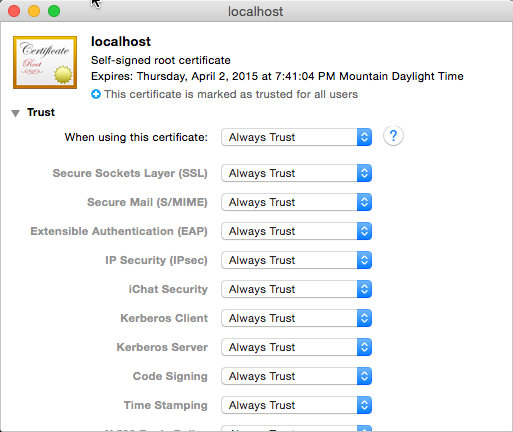
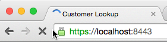

# Add Self-Signed Certificate as Trusted Root Authority
In this exercise you will add the self-signed certificate to your local machine as a Trusted Root Authority.

1. Within Chrome, do the following:

  1. In the address bar, click the little lock with the X. This will bring up a small information screen. Click the button that says "Certificate Information."
  1. Click and drag the image to your desktop. It looks like a little certificate.

  

1. Open the **Keychain Access** utility in OS X.
  1. Select the **System** option on the left.
  1. Click the lock icon in the upper-left corner to enable changes.

  

  1. Click the plus button at the bottom and select the **localhost.cer** file you copied to the desktop.
  1. In the dialog that comes up, click **Always Trust**.
  1. After **localhost** gets added to the **System** keychain, double-click it to open it again.
  1. Expand the **Trust** section and for the first option, pick **Always Trust**.

  

At this point everything has been configured. Quick Chrome and all other browsers and try again to navigate to the local HTTPS site. The browser should report it as a valid certificate:

At this point you now have a self-signed certificate installed on your machine.